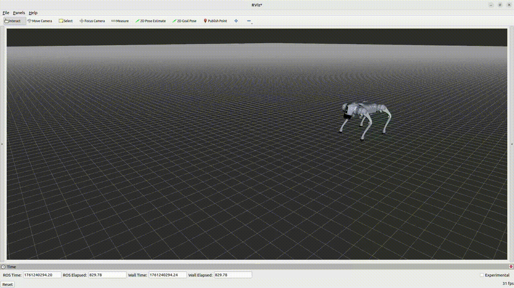

# <h2 align="center">DEPLOY SIM-TO-REAL RL MODEL ON Go2</h2>


**This repository aims to train a **Reinforcement Learning (RL)** model on the **Unitree Go2 quadruped robot** in simulation (IsaacLab) and deploy it on the real robot.
It also includes the use of a **Kalman filter** for pose and velocity estimation, ensuring accurate state feedback during real-world deployment.**


<p align="center">
  <b>Simulation IsaacLab</b>
  
  <br>
</p>


<table align="center" style="border-collapse:collapse;">
<th style="width:50%; text-align:center;">
  <div style="display:inline-block; width:200px;">Deploy on real robot </div>
</th>
<th style="width:50%; text-align:center;">
  <div style="display:inline-block; width:200px;">Real time Kalman filter</div>
</th>

  <tr>
    <td style="width:50%; text-align:center;">
      
    </td>
    <td style="width:50%; text-align:center;">
      
    </td>
  </tr>
</table>


---
## Project overview

This project implements a complete **Sim-to-Real** pipeline:

 - 🎮 How to train Reinforcement Learning (RL) policies on **IsaacLab Simulation**

 - 🤖 How to **deploy models on the real Go2 robot** via the Unitree SDK

 - 🔄 How to use **ROS 2 Communication** and **Kalman filter (Inria Paris)** for real-time control and sensor/command integration

The project combines **Python + ROS 2 + IsaacLab + Kalman filter (Inria Paris)**, enabling training, testing, and transferring an RL policy to the real robot.

---
## 📁 Architecture

```
deploy_go2/
│
├── deploy_real/                # Deployment scripts for Go2
│   ├── config.py
│   ├── deploy_real_isaaclab.py
│   └── node_kalman.py
│
├── pre_train/                  # Pre-trained RL models (policies)
│   ├── policy_rough.pt
│   └── ...
│
├── unitree_sdk2_python/        # SDK Unitree
│
├── go2_ws/                     # Kalman Filter for Go2 (Inria Paris)
│
└── README.md                 

Isaaclab
```

---
## ⚙️ System Requirements

|  Component |  Recommended Version |
|--------------|------------------------|
| **Ubuntu** | 22.04 LTS |
| **Python** | 3.10+ |
| **ROS 2** | Humble |
| **Isaac Sim / Isaac Lab** | 4.0.0+ |
| **CUDA (optionnel)** | 11.8+ |


---
<h2 align="center">🔧 Installation Guides🔧</h2> 

[📘 How to train Reinforcement Learning (RL) policies on **IsaacLab Simulation**](doc/Isaaclab.md)

[📘 How to **deploy models on the real Go2 robot** via the Unitree SDK](doc/Deploy.md)

[📘 How to use  **Kalman filter (Inria Paris)** for real-time control and sensor/command integration](doc/Deploy_with_Kalman_filter.md)

---

##  Links

These are the repositories I used for my project :

| 🔗 Resources | 📍 Link |
|--------------|---------|
|  **IsaacLab (NVIDIA)** | [https://github.com/isaac-sim/IsaacLab](https://github.com/isaac-sim/IsaacLab) |
|  **Unitree SDK2 Python** | [https://github.com/unitreerobotics/unitree_sdk2_python](https://github.com/unitreerobotics/unitree_sdk2_python) |
|  **unitree_rl_gym** | [https://github.com/TheoBounac/Deploy_SimToReal_Go2](https://github.com/unitreerobotics/unitree_rl_gym/tree/main) |
|  **Kalman filter for Go2** | [https://github.com/inria-paris-robotics-lab/go2_odometry?tab=readme-ov-file](https://github.com/inria-paris-robotics-lab/go2_odometry?tab=readme-ov-file) |


---


##  Author

**Théo Bounaceur**  
Laboratory **LORIA** (**CNRS** / **University of Lorraine**), Nancy in France  
🧬 Développement : Reinforcement Learning · Unitree robots · Anymal · IsaacLab · ROS 2 · Unitree SDK2  
📫 Contact : theo.bounaceur@loria.fr

---


