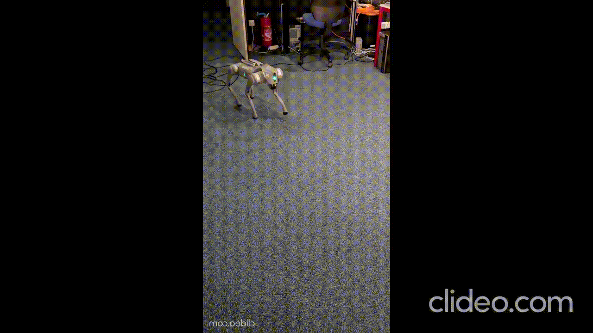

# <h2 align="center">DEPLOY SIM-TO-REAL RL MODEL ON Go2</h2>


**This repository aims to train a **Reinforcement Learning (RL)** model on the **Unitree Go2 quadruped robot** in simulation (IsaacLab) and deploy it on the real robot.**

<table align="center" width="60%">
  <tr>
    <th align="center">IsaacLab</th>
  </tr>
  <tr>
    <td align="center">
      
    </td>
  </tr>
</table>

<table align="center" width="100%">
  <colgroup>
    <col width="33.33%">
    <col width="33.33%">
    <col width="33.33%">
  </colgroup>
  <tr>
    <th align="center">Reality</th>
    <th align="center">Simulation</th>
    <th align="center">Real-time Rviz2 Observation</th>
  </tr>
  <tr>
    <td align="center">
      
    </td>
    <td align="center">
      
    </td>
    <td align="center">
      <


---
## Project overview

This project implements a complete **Sim-to-Real** pipeline:

 - 🎮 **IsaacLab Simulation** for training Reinforcement Learning (RL) policies

 - 🤖 **Deployment on the real Go2 robot** via the Unitree SDK

 - 🔄 **ROS 2 Communication** for real-time control and sensor/command integration

The project combines **Python + ROS 2 + IsaacLab**, enabling training, testing, and transferring an RL policy to the real robot.

---
## 📁 Architecture

```
deploy_go2/
│
├── deploy_real/                # Deployment scripts for Go2
│   ├── config.py
│   ├── deploy_real_isaaclab.py
│   └── node_kalman.py
│
├── pre_train/                  # Pre-trained RL models (policies)
│   ├── policy_rough.pt
│   └── ...
│
├── unitree_sdk2_python/        # SDK Unitree
│
├── go2_odometry/               # Kalman Filter for Go2
│
└── README.md                 

Isaaclab
```

---
## ⚙️ System Requirements

|  Component |  Recommended Version |
|--------------|------------------------|
| **Ubuntu** | 22.04 LTS |
| **Python** | 3.10+ |
| **ROS 2** | Humble |
| **Isaac Sim / Isaac Lab** | 4.0.0+ |
| **CUDA (optionnel)** | 11.8+ |


---
<h2 align="center">🔧 Installation Guide🔧</h2> 

###  1️⃣ Env conda setup
Create a conda environment for the project :
```bash
conda create -n env_isaaclab python=3.10.18
conda activate env_isaaclab
```

---
Ensure the latest pip version is installed. To update pip, run the following command from inside the virtual environment :
```bash
pip install --upgrade pip
```

---
Install a CUDA-enabled PyTorch 2.7.0 build for CUDA 12.8 :
```bash
pip install torch==2.7.0 torchvision==0.22.0 --index-url https://download.pytorch.org/whl/cu128
```


---
###  2️⃣ Clone the project

```bash
git clone https://github.com/TheoBounac/Deploy_SimToReal_Go2.git
cd Deploy_SimToReal_Go2
```
---
Install depedencies :
```bash
pip install -r requirements.txt
```

---
###  3️⃣ Clone SDK Unitree
unitree_sdk2py is a library used for communication with **Unitree** robots in python. 

Clone the repository using Git :
```bash
git clone https://github.com/unitreerobotics/unitree_sdk2_python.git
```
Environment Variable :
```bash
echo 'export LD_PRELOAD=/usr/lib/x86_64-linux-gnu/libstdc++.so.6' >> ~/.bashrc
```
Navigate to the directory and install it:
```bash
cd unitree_sdk2_python
pip install -e .
```

---

<h2 align="center">🚀 Run the project 🚀</h2> 

Once the installation is complete, follow these steps to launch an RL model on the Go2 robot.

1. Activate conda env :
   ```bash
   conda activate env_isaaclab
   ```
2. Navigate to `deploy_real`:
   ```bash
   cd ~/Deploy_SimToReal_Go2/deploy_real
   ```
3. Run `deploy_real_isaaclab.py`:
   ```bash
   python deploy_real_isaaclab.py enp0s31f6 go2.yaml
   ```

---

##  Links

| 🔗 Resources | 📍 Link |
|--------------|---------|
|  **IsaacLab (NVIDIA)** | [https://github.com/isaac-sim/IsaacLab](https://github.com/isaac-sim/IsaacLab) |
|  **Unitree SDK2 Python** | [https://github.com/unitreerobotics/unitree_sdk2_python](https://github.com/unitreerobotics/unitree_sdk2_python) |
|  **Projet principal** | [https://github.com/TheoBounac/Deploy_SimToReal_Go2](https://github.com/TheoBounac/Deploy_SimToReal_Go2) |


---


##  Author

**Théo Bounaceur**  
Laboratory **LORIA** (**CNRS** / **University of Lorraine**), Nancy in France  
🧬 Développement : IsaacLab · ROS 2 · Unitree SDK2  
📫 Contact : theo.bounaceur@loria.fr

---

---
###  4️⃣ Cloner go2_odometry
```bash
cd ..
git clone https://github.com/inria-paris-robotics-lab/go2_odometry.git
```

---
###  5️⃣ Installer Isaaclab
Cette partie est optionnelle, elle permet d'entraîner sois-même des modèles de RL. Des modèles pré-entraînés sont déja disponibles dans `pre_train`. 

Pour installer Isaaclab, vous pouvez vous référer au [guide isaaclab](https://isaac-sim.github.io/IsaacLab/main/source/setup/installation/pip_installation.html).
Les commandes importantes sont rappelées ci-dessous.

Install the Isaac Lab packages along with Isaac Sim :
```bash
pip install isaaclab[isaacsim,all]==2.2.0 --extra-index-url https://pypi.nvidia.com
```
Make sure that your virtual environment is activated. Check that the simulator runs as expected :
```bash
isaacsim
```

The first run will prompt users to accept the Nvidia Omniverse License Agreement. To accept the EULA, reply `Yes` when prompted with the below message:
```bash
By installing or using Isaac Sim, I agree to the terms of NVIDIA OMNIVERSE LICENSE AGREEMENT (EULA)
in https://docs.isaacsim.omniverse.nvidia.com/latest/common/NVIDIA_Omniverse_License_Agreement.html

Do you accept the EULA ? (Yes/No): Yes
```
Cela devrait prendre quelque minutes pour la première run.

Lancer un entrainement du go2 :
```bash
cd isaaclab
./isaaclab.sh -p scripts/reinforcement_learning/rsl_rl/train.py  --task Isaac-Velocity-Rough-Unitree-Go2-v0  --num_envs 4080  --max_iterations 9999 --headless
```

Tester le modèle :
```bash
./isaaclab.sh -p scripts/reinforcement_learning/rsl_rl/play.py  --task Isaac-Velocity-Rough-Unitree-Go2-v0  --num_envs 4
```
 7️⃣ 8️⃣ 9️⃣ 🔟


