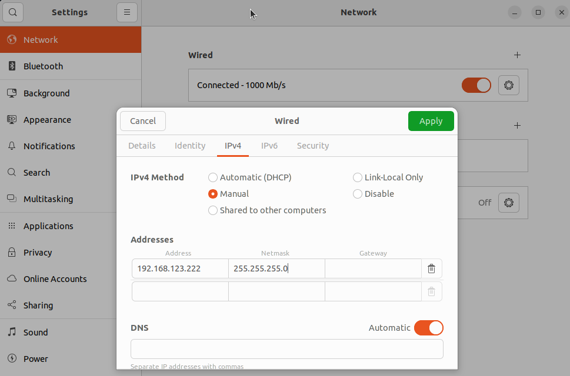

# <h2 align="center">DEPLOY</h2>


**This section aims to **deploy** on the Go2 robot, a low level RL model (policy). You can either train an RL model in IsaacLab (see **Part 1 :** [How to train RL policies in IsaacLab Simulation](https://github.com/TheoBounac/Deploy_SimToReal_RL_Go2/blob/main/doc/Isaaclab.md)) or use a pre-trained model provided in this project.**


<p align="center">
  
  <br>
</p>


## 📁 Architecture of this section

```
deploy_go2/
│
├── deploy_real/                # Deployment scripts for Go2
│   ├── config.py
│   ├── deploy_real_isaaclab.py
│   └── node_kalman.py
│
├── pre_train/                  # Pre-trained RL models (policies)
│   ├── policy_rough.pt
│   └── policy_rough_2.pt
│
├── unitree_sdk2_python/        # SDK Unitree
│
├── Kalman_filter/              # Kalman Filter for Go2 (Inria Paris)
│
└── README.md                 
```

---
## ⚙️ System Requirements for this section

|  Component |  Recommended Version |
|--------------|------------------------|
| Go2 robot (Unitree) | Edu with feet sensors|
| **Ubuntu** | 22.04 LTS |
| **Python** | 3.10+ |
| **ROS 2** | Humble |


---
<h2 align="center">🔧 Installation Guide : Deploy🔧</h2> 

###  1️⃣ Env conda setup
Create a conda environment for the project :
```bash
conda create -n env_isaaclab python=3.10.18
conda activate env_isaaclab
```


Ensure the latest pip version is installed. To update pip, run the following command from inside the virtual environment :
```bash
pip install --upgrade pip
```


Install a CUDA-enabled PyTorch 2.7.0 build for CUDA 12.8 :
```bash
pip install torch==2.7.0 torchvision==0.22.0 --index-url https://download.pytorch.org/whl/cu128
```


---
###  2️⃣ Clone the project

```bash
git clone https://github.com/TheoBounac/Deploy_SimToReal_Go2.git
cd Deploy_SimToReal_Go2
```

Install depedencies :
```bash
pip install -r requirements.txt
```

---
###  3️⃣ Clone SDK Unitree
unitree_sdk2py is a library used for communication with **Unitree** robots in python. 

Clone the repository using Git :
```bash
cd ~/Deploy_SimToReal_Go2
git clone https://github.com/unitreerobotics/unitree_sdk2_python.git
```

Navigate to the directory and install it:
```bash
cd unitree_sdk2_python
pip install -e .
```

At this point, your folder should look like this :

 <p align="center">
  
  <br>
 </p>
 
---
###  4️⃣ Clone Go2_odometry
Install the Kalman filter for the Go2 : [Github Inria Paris Go2_odometry](https://github.com/inria-paris-robotics-lab/go2_odometry?tab=readme-ov-file)

Here is a full tutorial on how to install this library :

[📘 How to use  **Kalman filter (Inria Paris)** for real-time control and sensor/command integration](Deploy_with_Kalman_filter.md)

---

<h2 align="center">🚀 Run the project : Deploy 🚀</h2> 

Once the installation is complete, follow these steps to launch an RL model on the Go2 robot.

1. Activate conda env :
   ```bash
   conda activate env_isaaclab
   ```
2. Connect the robot with ethernet
   
   Turn on the robot and connect it to your PC using an Ethernet cable.
   Go to Settings/Network and then IPv4. Fill the gaps as follows :
   
   <p align="center">
    
    <br>
   </p>
3. Collect the network interface

   Type in the terminal, and collect the adress :

   ```bash
   ifconfig
   ```
   <p align="center">
    
    <br>
   </p>
   
4. Navigate to `deploy_real`:
   ```bash
   cd ~/Deploy_SimToReal_Go2/deploy_real
   ```

⚠️ **Safety Notice:**  
Make sure the robot is standing in an open area, free of obstacles or people nearby.
   
5. Run `deploy_real_isaaclab.py` with your network interface :
   ```bash
   export LD_PRELOAD=/usr/lib/x86_64-linux-gnu/libstdc++.so.6
   python deploy_real_isaaclab.py enp0s31f6 go2.yaml
   ```

   ---
🦾 **Deployment Sequence**

1. Run the command to launch `deploy_real_isaaclab.py` with the `go2.yaml` configuration.  
2. The robot will exit its default mode and lie down.  
3. Press the **Select** button on the remote to make the robot stand up.  
4. Press the **A** button to activate the trained model.


