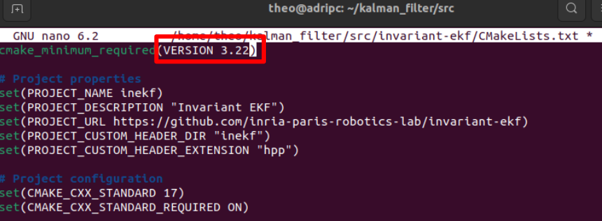

# <h2 align="center">Go2 Odometry — **Invariant EKF (InEKF) Full Setup Guide**</h2>

**A step-by-step README to reproduce the exact working setup we used (ROS 2 Humble, Conda, Unitree ROS 2, go2_odometry, invariant-ekf), with explanations and commands.**

 <p align="center">
  
  <br>
 </p>

 


---
## Overview

**Go2 Odometry** is an INRIA Paris GitLab project that implements a Kalman-based state estimation pipeline for the Unitree **Go2 quadruped robot**.  
It provides robust **pose** and **velocity estimation** using an Invariant Extended Kalman Filter (InEKF) integrated with the robot’s onboard sensors.  
This guide explains, step by step, how to set up the complete environment required to run the Kalman filter and how to **visualize the Go2 robot in real time** using **RViz2**.

---
## ⚙️ System Requirements

|  **Component** |  **Recommended Setup** |
|------------------|--------------------------|
| **Ubuntu** | 22.04 LTS (Jammy) |
| **ROS 2** | Humble — installed via `apt` in `/opt/ros/humble` |
| **Conda** | Miniconda |
| **Python** | 3.10  |


---
## 1️⃣ 🐍 Create & prepare the Conda environment

Create your workspace :
```bash
mkdir -p ~/kalman_filter/src
```


Create the env conda :
```bash
conda create -n go2_odometry_env python=3.10 -y
conda activate go2_odometry_env
```

Versions of libraries that play nicely with ROS 2 Humble and Pinocchio :
```bash
pip install "numpy==1.26.4"
pip install "empy==3.3.4" "catkin-pkg==1.1.0" "lark-parser==0.12.0" "pyyaml==6.0.1"
pip install colcon-common-extensions
```


---
## 2️⃣ 🤖 Ensure ROS 2 Humble is installed & sourced

Install [ROS 2 Humble](https://docs.ros.org/en/jazzy/Installation.html). Then, add to path :

```bash
# run this in every new terminal session where you use ROS 2
source /opt/ros/humble/setup.bash
```


---
## 3️⃣ 📂 Clone the required repositories

<p align="center">

<br>
</p>


```bash
cd ~/kalman_filter/src

# A) Unitree ROS 2 interface (message definitions, DDS/ROS bridge)
git clone https://github.com/unitreerobotics/unitree_ros2.git

# B) Go2 URDF & description
git clone https://github.com/inria-paris-robotics-lab/go2_description.git

# C) Invariant EKF (C++ library)
git clone https://github.com/inria-paris-robotics-lab/invariant-ekf.git

# D) Odometry stack (fake, mocap, InEKF wrapper & launch files)
git clone https://github.com/inria-paris-robotics-lab/go2_odometry.git
```

---
## 4️⃣ 🧰 System dependencies via apt

This command installs all the required system components to run the Go2's ROS 2 communication and InEKF Kalman filter — including the DDS transport layer, IDL message generation, YAML parsing, and Pinocchio dynamics library :


```bash
sudo apt update
sudo apt install -y \
  ros-humble-rmw-cyclonedds-cpp \
  ros-humble-rosidl-generator-dds-idl \
  libyaml-cpp-dev \
  python3-pinocchio
```


---
## 5️⃣ 🏗️ Build and install the Invariant EKF (C++ lib)

**Invariant-EKF uses JRL cmake modules that require `cmake >= 3.22`.** We’ll ensure CMake is recent enough from Conda and set the project minimum accordingly.

```bash
# Make sure CMake is recent enough
conda install -c conda-forge cmake=3.28.3 -y
cmake --version   # should be >= 3.22
```

Open `~/kalman_filter/src/invariant-ekf/CMakeLists.txt` with :

```bash
nano ~/kalman_filter/src/invariant-ekf/CMakeLists.txt
```

And set :
```cmake
cmake_minimum_required(VERSION 3.22)
```
<p align="center">

<br>
</p>

---
Confirm NumPy is visible to CMake (it will be queried via eigenpy during config):
```bash
python -c "import numpy; print(numpy.__version__)"  # must print 1.26.4
```
If not (Troubleshooting), just reinstall numpy :
```bash
pip install --upgrade numpy==1.26.4
```
---

Now build & install :
```bash
cd ~/kalman_filter/src/invariant-ekf
rm -rf build && mkdir build && cd build
cmake ..
make -j"$(nproc)"
sudo make install
sudo ldconfig
```


---
## 6️⃣ 🧩 Verify Pinocchio ↔ NumPy compatibility

```bash
python - <<'EOF'
import numpy, pinocchio
print("NumPy:", numpy.__version__)
print("Pinocchio:", pinocchio.__version__, " @ ", pinocchio.__file__)
EOF
```

Expected: **NumPy 1.26.x**; Pinocchio loads from `/opt/ros/humble/...`.  
If NumPy got bumped to 2.x by a stray install, **force** :
```bash
pip install --force-reinstall "numpy==1.26.4"
```

---
## 7️⃣ 🔧 **Required fixes** for `go2_odometry` (InEKF executable)

Recent versions of `go2_odometry` may **not install the Python nodes** where ROS expects them, and the launch uses `inekf_odom.py` instead of the installed name.

To fix that, open `~/kalman_filter/src/go2_odometry/CMakeLists.txt` with :
```bash
nano ~/kalman_filter/src/go2_odometry/CMakeLists.txt 
```

and set the **Install Python executables** :
```cmake
# === Install Python executables ===
install(PROGRAMS scripts/fake_odom.py  DESTINATION lib/${PROJECT_NAME} RENAME fake_odom.py)
install(PROGRAMS scripts/dumb_odom.py  DESTINATION lib/${PROJECT_NAME} RENAME dumb_odom.py)
install(PROGRAMS scripts/mocap_base_pose.py  DESTINATION lib/${PROJECT_NAME} RENAME mocap_base_pose.py)
install(PROGRAMS scripts/inekf_odom.py  DESTINATION lib/${PROJECT_NAME} RENAME inekf_odom.py)
```
<p align="center">

<br>
</p>


---
## 8️⃣ 🏗️ Build the workspace

```bash
# Always source ROS 2 before colcon
source /opt/ros/humble/setup.bash

cd ~/kalman_filter
colcon build --symlink-install
colcon build --symlink-install
```

> If you previously built with wrong settings, do a clean rebuild:
> ```bash
> rm -rf build install log
> colcon build --symlink-install
> ```


---
## 9️⃣ 🔍 Sanity checks

```bash
# Source ROS 2 + your workspace
source /opt/ros/humble/setup.bash
source ~/kalman_filter/install/setup.bash

# List packages
ros2 pkg list | grep go2
ros2 pkg list | grep unitree
```

Expected:  
`go2_description`, `go2_odometry` and `unitree_api`, `unitree_go`, `unitree_hg`, `unitree_ros2_example`.

<p align="center">

<br>
</p>


> You may see a harmless note like:
> ```
> not found: ".../install/inekf/share/inekf/local_setup.bash"
> ```
> That’s fine — **inekf** is a C++ library, not a ROS 2 Python package.


---
## 🔟  Quick run: **fake odom** (debug)

> Why: validate TF, URDF, and topic wiring in seconds.

**If you are inside a Conda env, pre-load the system libstdc++** or `rclpy` may complain about `GLIBCXX`:
```bash
export LD_PRELOAD=/usr/lib/x86_64-linux-gnu/libstdc++.so.6
```

Launch:
```bash
source /opt/ros/humble/setup.bash         # Make sure it is sourced
source ~/kalman_filter/install/setup.bash #

ros2 launch go2_odometry go2_odometry_switch.launch.py odom_type:=fake base_height:=0.30
```

In another terminal:
```bash
source /opt/ros/humble/setup.bash         # Make sure it is sourced
source ~/kalman_filter/install/setup.bash #

ros2 topic list
ros2 topic echo /odometry/filtered
```

<p align="center">

<br>
</p>

You should see fixed poses at `(x=0, y=0, z=base_height)` and the odometry/filtered streams.


---
## 1️⃣1️⃣ 🚀 Run the **real filter** (InEKF)

```bash
# In Conda: keep this to avoid GLIBCXX mismatches with rclpy
export LD_PRELOAD=/usr/lib/x86_64-linux-gnu/libstdc++.so.6
```
And launched with :

```bash
source /opt/ros/humble/setup.bash         # Make sure it is sourced
source ~/kalman_filter/install/setup.bash #

ros2 launch go2_odometry go2_odometry_switch.launch.py odom_type:=use_full_odom
```

**What this launch does**
- Starts `go2_inekf_odometry.launch.py`
- Runs `inekf_odom` (Python node wrapping InEKF C++ core)
- Starts `state_converter_node` (converts Unitree custom msgs → standard ROS)
- Runs `robot_state_publisher` (URDF → TF stream)

**You should see topics**

Open a new terminal and just type :
```
ros2 topic list
```

 <p align="center">
  
  <br>
 </p>

 <p align="center">
  
  <br>
 </p>

 
> 🔭 The data are collected from the robot through the `/lowstate` topic provided by the Unitree ROS 2 interface.  
After processing with the Kalman filter, the **pose** and **velocity estimations** are published on the `/odometry/filtered` topic.  
Additionally, the `/robot_description` topic provides the pose and orientation of each part of the robot, allowing real-time visualization of the Go2 model in **RViz2**.


---
## 🧯 Troubleshooting & common pitfalls

| Symptom | Cause | Fix |
|---|---|---|
| `GLIBCXX_3.4.30 not found` when running `ros2` in Conda | Conda’s libstdc++ overrides system | `export LD_PRELOAD=/usr/lib/x86_64-linux-gnu/libstdc++.so.6` |
| Pinocchio segfault / `_ARRAY_API not found` | NumPy 2.x incompatible with old C++ bindings | `pip install --force-reinstall "numpy==1.26.4"` |
| `Failed to detect numpy` during InEKF CMake | eigenpy can’t find NumPy headers in this Python | `cmake .. -DPYTHON_EXECUTABLE=$(which python) -DNUMPY_INCLUDE_DIR=$(python -c 'import numpy; print(numpy.get_include())')` |
| `No module named 'em'/'catkin_pkg'/'lark'` during `colcon build` | ROSIDL runs with Conda Python; modules missing | `pip install empy catkin-pkg lark-parser pyyaml` |
| `executable 'inekf_odom.py' not found` | Launch expects `.py`; CMake installs without `.py` | **Fix launch** → `executable="inekf_odom"` **and** ensure CMake `install(PROGRAMS ... RENAME inekf_odom)` |
| KDL warning about inertia on root link | KDL limitation with URDF root inertias | Harmless; ignore or add a dummy base if you want a clean console |


## 📝 Rationale: why the `LD_PRELOAD`?

When you run ROS 2 Python nodes from a **Conda environment**, Conda provides its own `libstdc++.so.6`. ROS 2 Humble’s wheels (`rclpy`, others) were built against the **system** libstdc++ (newer GLIBCXX symbols). Pre-loading the system libstdc++:

```bash
export LD_PRELOAD=/usr/lib/x86_64-linux-gnu/libstdc++.so.6
```

tells the dynamic loader to **prefer the system runtime**, preventing the `GLIBCXX_*` family of errors. It’s the cleanest fix when you want Conda + ROS 2 to coexist.


---
## 🎉 You’re done!

Happy state estimation 🧪🤖!
